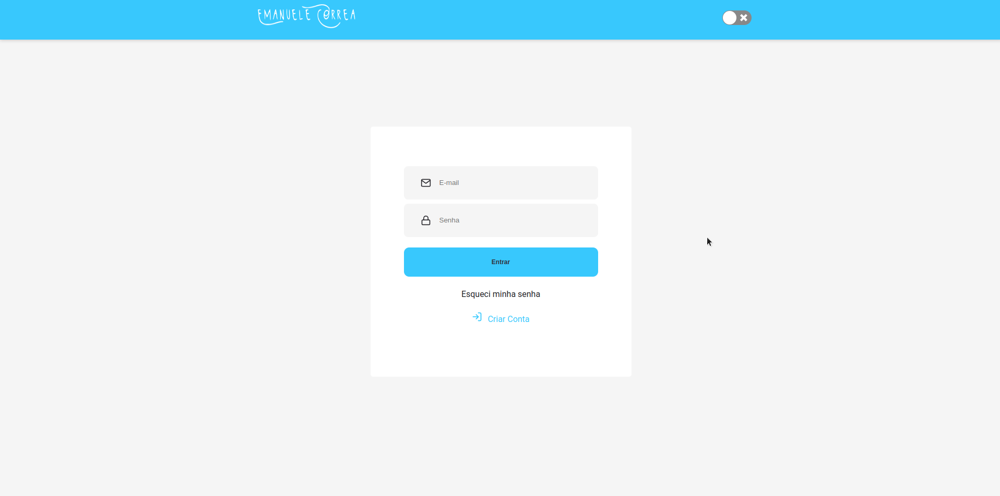
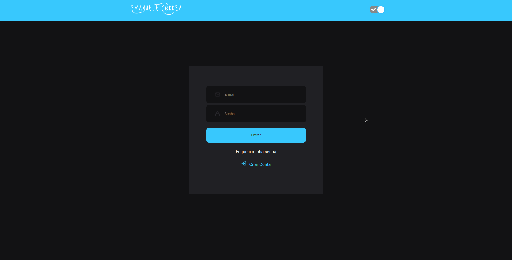

# Projeto de autenticação

**Light**


**Dark**



```bash
# Clonar repositorios
$ git clone https://github.com/manuncorrea/authentication

# Go into the repository
$ cd authentication

# Instale dependências para o front-end e execute o servidor
$ yarn install
$ yarn dev

```